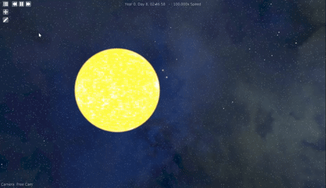
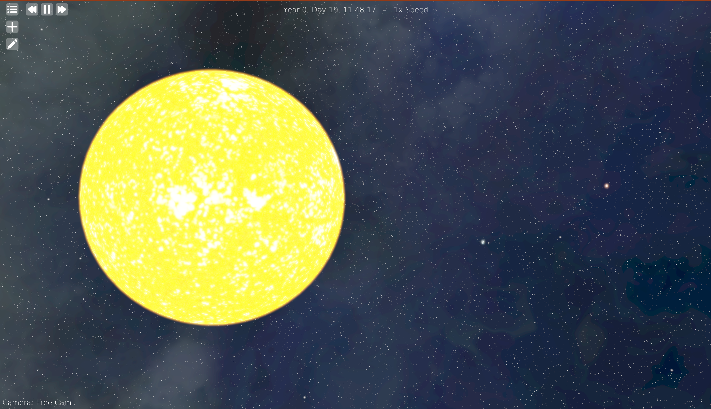
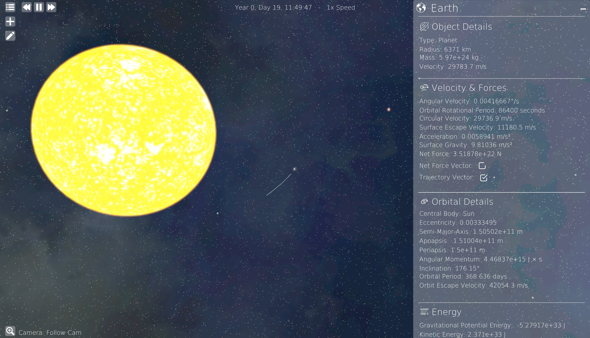
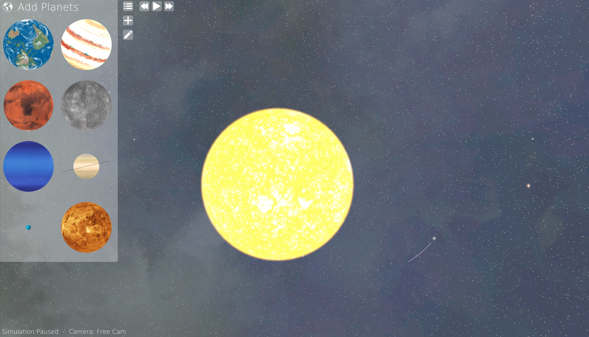
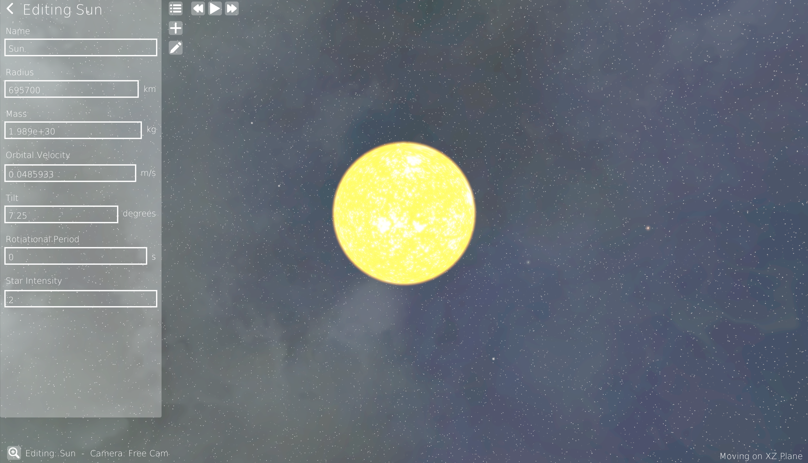

# 3D Orbital Simulator

A real time 3D orbital mechanics simulator built with C++, OpenGL, and SDL.  
The project models gravitational motion and renders trajectories with an interactive camera and object controls.

## Overview

This project simulates bodies under gravitational interaction using numerical integration.  
It focuses on visualizing orbital dynamics in a scalable and interactive environment.

## Core Features

- N body gravitational simulation
- Real time trajectory prediction and rendering
- Scaled space representation for large distances
- Interactive object selection and manipulation
- Camera system with rotation, zoom, and translation
- Custom OpenGL rendering pipeline
- SDL based windowing and input system

## Demo







## Technical Details

### Physics

- Uses Newtonian gravity
- Force calculation between bodies based on mass and distance
- Motion integrated over time using a step based update loop
- Time scaling supported for fast forward simulation

### Rendering

- OpenGL used for all rendering
- Objects rendered with position scaling to maintain precision
- Trajectories drawn as line paths based on velocity integration
- Skybox and visual effects supported

### Architecture

- Modular structure separating simulation, rendering, and input
- Event system handles user interaction
- Simulation loop decoupled from rendering frame timing

## Requirements

- C++17 compatible compiler
- OpenGL compatible GPU

## Build

Clone the repository:

```
git clone https://github.com/Mysty-exe/3D-Orbital-Simulator.git
cd 3d-orbital-simulator
```

Build with CMake:

```
mkdir build
cd build
cmake ..
cmake --build . --config Release
```

## Run

Linux or macOS:

```
./3DOrbitalSimulator
```

Windows:

```
3DOrbitalSimulator.exe
```

## Controls

General

- ESC: open controls menu

Camera

- W A S D: move horizontally
- Space: move up
- Shift: move down
- Right Arrow / Left Arrow: increase or decrease camera speed

Simulation

- Ctrl + Plus: increase simulation speed
- Ctrl + Minus: decrease simulation speed
- Ctrl + P: pause or resume simulation

Object Interaction

- Ctrl + Right Arrow / Left Arrow: Follow an object
- Ctrl + Backspace: Stop following an object

Editing (while object is being edited)

- Ctrl + D: duplicate object
- Delete: delete object

## Project Structure

```
src/      core source files
libs/     required libraries
include/  headers
assets/   textures, models
shaders/  shader (glsl) files
build/    generated build files
```

## Future Work

- Higher order integration methods
- Collision detection and merging
- Improved numerical stability
- UI layer for simulation control
- Save and load system states

## Notes

- Distances and radii are scaled to maintain numerical stability
- Large simulations depend on CPU performance
